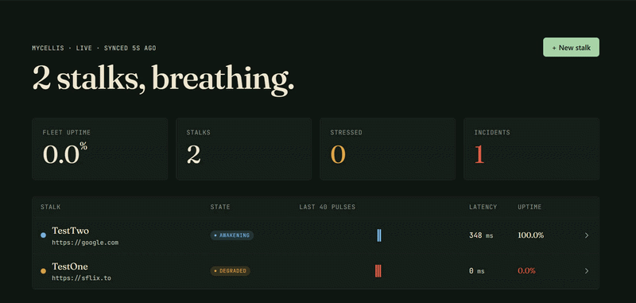
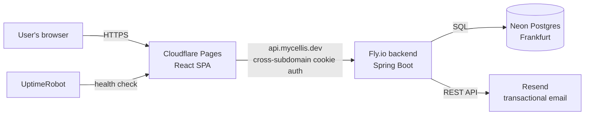
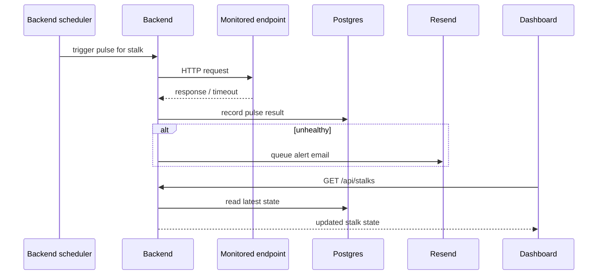
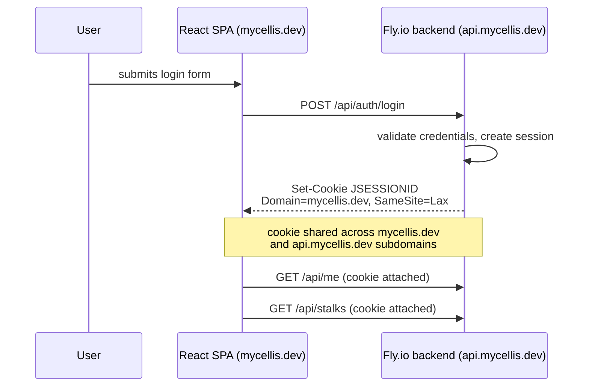
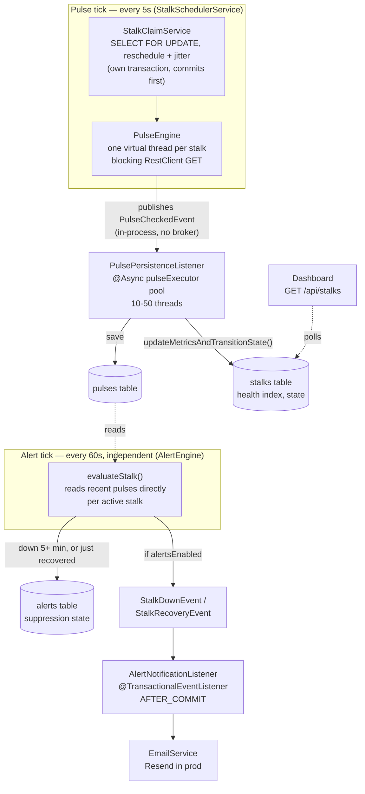
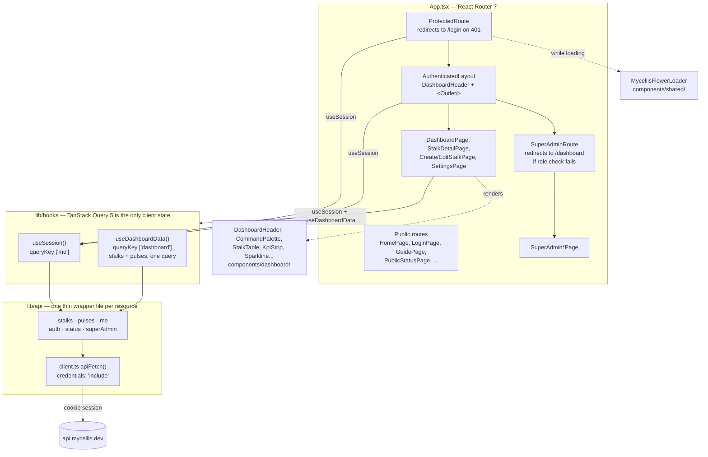

# Mycellis

<p>
  
</p>

<p>
  
  
  
  
  
  
  
</p>

## What it is

Mycellis watches the endpoints your product depends on and tells you the moment one stops breathing normally — health, latency, and uptime, in real time.

<p>
  
</p>

## Project structure

Monorepo, two independently deployed apps:

- `backend/` — Spring Boot 4 (Java 21) REST API. Maven project, deployed to Fly.io as a Docker container.
- `frontend/` — Vite + React SPA. Deployed to Cloudflare Pages.
- `docs/` — internal notes: brand guidelines, architecture decisions, deploy-day reference.
- `grafana/`, `prometheus.yml` — local Prometheus/Grafana provisioning, wired up via `docker-compose.yml`.
- `docker-compose.yml` — local Postgres and MailHog (fake SMTP) for backend development, plus Prometheus/Grafana. Does not run the backend itself — that runs directly via Maven.

## Tech stack

**Backend:** Spring Boot 4, Java 21, PostgreSQL (Neon in production, local Docker Postgres in dev), Fly.io hosting, Resend for transactional email, Flyway migrations.

**Frontend:** Vite, React 19, Tailwind CSS 3, React Router 7, TanStack Query 5, deployed to Cloudflare Pages.

## Quick Start

### Backend

Prerequisites: JDK 21, Docker (for local Postgres/MailHog). Maven itself isn't required — the repo ships a wrapper (`mvnw` / `mvnw.cmd`).

```bash
git clone <repo-url>
cd mycellis/backend

# Start local Postgres + MailHog — the dev profile's datasource is
# hardcoded to match this compose file's credentials exactly
docker compose up -d postgres mailhog

# Run the app — dev is the default profile, no extra flags needed
./mvnw spring-boot:run
```

The API comes up on `http://localhost:8080`. The dev profile boots with **zero required environment variables** — optional ones (admin seeding, Resend) are documented in `backend/.env.example`. Spring Boot doesn't auto-load `.env` files, so export them in your shell or your IDE's run configuration if you want those optional features locally.

### Frontend

Prerequisites: Node 20 LTS or newer (no version pinned in this repo), npm (this repo commits `package-lock.json`, not a pnpm or yarn lockfile).

```bash
cd frontend
cp .env.example .env.local   # only needed to point at a non-default API URL
npm install
npm run dev
```

Dev server runs on `http://localhost:5173` and proxies `/api` and `/actuator` to `localhost:8080` (see `vite.config.ts`) — you don't need to set `VITE_API_BASE_URL` locally unless you're pointing at a deployed backend.

```bash
npm run build   # outputs to frontend/dist
npm run lint
```

## Architecture

### System overview



### Pulse cycle

A stalk (monitored endpoint) gets checked on its own schedule; this is one cycle.



### Auth flow



### Backend internals

The pulse tick and alert tick are two separate, independently-scheduled loops rather than one pipeline — the code frames this as deliberate: alerting only needs a 60-second cadence at beta scale, and decoupling it from the 5-second pulse tick keeps alert evaluation from ever slowing down the check cycle. Within a single tick, the claim phase (which takes row locks) and the dispatch phase (which makes outbound HTTP calls) are split into separate transactional boundaries specifically so locks are released before any network I/O begins. `PulseEngine` leans on JDK 21 virtual threads — one per check — to get high concurrency from ordinary blocking calls rather than needing a reactive stack. There's no external message queue anywhere in this flow; "async" here means Spring's in-process event bus plus two small bounded thread pools, not a broker.



### Frontend internals

There's no client-side state library beyond TanStack Query — two query keys (`['me']`, `['dashboard']`) are the entire application state, and `useDashboardData` deliberately merges two REST resources into one query so dependent UI (a stalk's state pill and its sparkline) can never visually desync between renders. Auth gating is composed at the route level (`ProtectedRoute` → `AuthenticatedLayout` → `SuperAdminRoute`) rather than duplicated per page, and the entire API layer is one `apiFetch()` wrapper with cookie-based sessions — no tokens are ever handled in the frontend.



## Deployment

Backend (from `backend/`, after committing):

```bash
fly deploy -a mycellis-backend
```

Frontend (from `frontend/`):

```bash
npm run build && npx wrangler pages deploy dist --project-name=mycellis
```

## Environment variables

See `backend/.env.example` and `frontend/.env.example` for the full list of variables each app reads, with comments on what each one does and which are optional. Production values are set as Fly secrets (`fly secrets set ...`) and Cloudflare Pages environment variables, respectively — no real values are committed anywhere in this repo.

## Documentation Index

| Doc | What's in it |
|---|---|
| [`RUNBOOK.md`](./RUNBOOK.md) | Incident response |
| [`COPYRIGHT.md`](./COPYRIGHT.md) | Ownership and license terms |
| [`POST_LAUNCH_ROADMAP.md`](./POST_LAUNCH_ROADMAP.md) | Planned post-launch work |
| [`TECH_DEBT.md`](./TECH_DEBT.md) | Known shortcuts and their payoff conditions |
