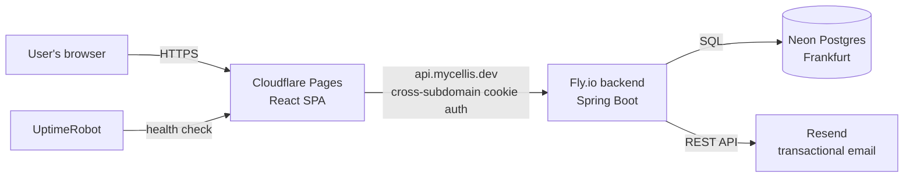
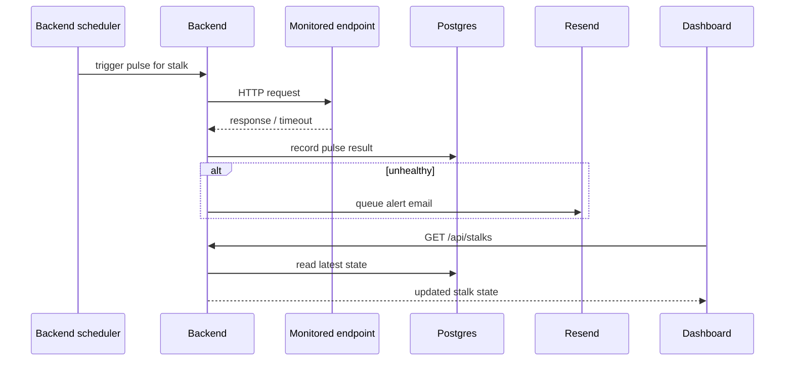
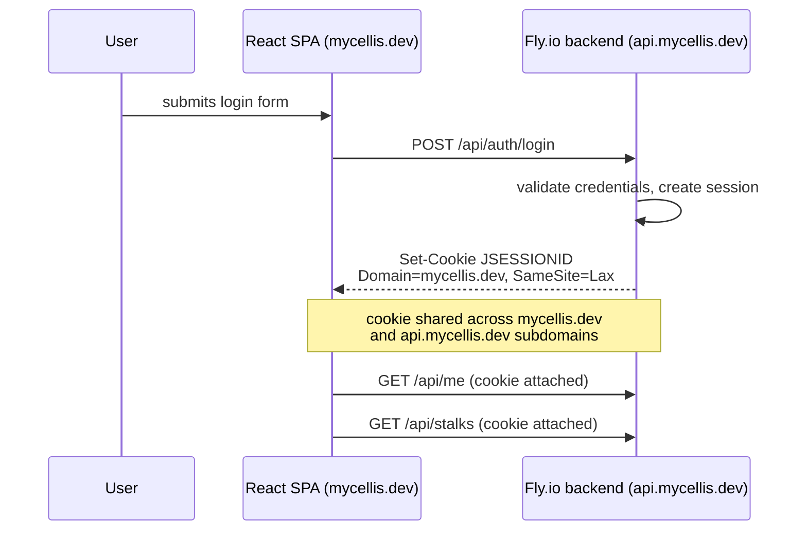

# Mycellis

Real-time monitoring for the endpoints your product depends on.

## Project structure

Monorepo, two independently deployed apps:

- `backend/` — Spring Boot 4 (Java 21) REST API. Maven project, deployed to Fly.io as a Docker container.
- `frontend/` — Vite + React SPA. Deployed to Cloudflare Pages.
- `docs/` — internal notes: brand guidelines, architecture decisions, deploy-day reference.
- `grafana/`, `prometheus.yml` — local Prometheus/Grafana provisioning, wired up via `docker-compose.yml`.
- `docker-compose.yml` — local Postgres and MailHog (fake SMTP) for backend development, plus Prometheus/Grafana. Does not run the backend itself — that runs directly via Maven.

## Tech stack

**Backend:** Spring Boot 4, Java 21, PostgreSQL (Neon in production, local Docker Postgres in dev), Fly.io hosting, Resend for transactional email, Flyway migrations.

**Frontend:** Vite, React 19, Tailwind CSS 3, React Router 7, TanStack Query 5, deployed to Cloudflare Pages.

## Architecture

### System overview



### Pulse cycle

A stalk (monitored endpoint) gets checked on its own schedule; this is one cycle.



### Auth flow



## Local development — Backend

Prerequisites: JDK 21, Docker (for local Postgres/MailHog). Maven itself isn't required — the repo ships a wrapper (`mvnw` / `mvnw.cmd`).

```bash
git clone <repo-url>
cd mycellis/backend

# Start local Postgres + MailHog — the dev profile's datasource is
# hardcoded to match this compose file's credentials exactly
docker compose up -d postgres mailhog

# Run the app — dev is the default profile, no extra flags needed
./mvnw spring-boot:run
```

The API comes up on `http://localhost:8080`. The dev profile boots with **zero required environment variables** — optional ones (admin seeding, Resend) are documented in `backend/.env.example`. Spring Boot doesn't auto-load `.env` files, so export them in your shell or your IDE's run configuration if you want those optional features locally.

## Local development — Frontend

Prerequisites: Node 20 LTS or newer (no version pinned in this repo), npm (this repo commits `package-lock.json`, not a pnpm or yarn lockfile).

```bash
cd frontend
cp .env.example .env.local   # only needed to point at a non-default API URL
npm install
npm run dev
```

Dev server runs on `http://localhost:5173` and proxies `/api` and `/actuator` to `localhost:8080` (see `vite.config.ts`) — you don't need to set `VITE_API_BASE_URL` locally unless you're pointing at a deployed backend.

```bash
npm run build   # outputs to frontend/dist
npm run lint
```

## Deployment

Backend (from `backend/`, after committing):

```bash
fly deploy -a mycellis-backend
```

Frontend (from `frontend/`):

```bash
npm run build && npx wrangler pages deploy dist --project-name=mycellis
```

## Environment variables

See `backend/.env.example` and `frontend/.env.example` for the full list of variables each app reads, with comments on what each one does and which are optional. Production values are set as Fly secrets (`fly secrets set ...`) and Cloudflare Pages environment variables, respectively — no real values are committed anywhere in this repo.

## Related docs

- [`RUNBOOK.md`](./RUNBOOK.md) — incident response
- [`COPYRIGHT.md`](./COPYRIGHT.md) — ownership and license terms
- [`POST_LAUNCH_ROADMAP.md`](./POST_LAUNCH_ROADMAP.md) — planned post-launch work
- [`frontend/TECH_DEBT.md`](./frontend/TECH_DEBT.md) — known shortcuts and their payoff conditions
